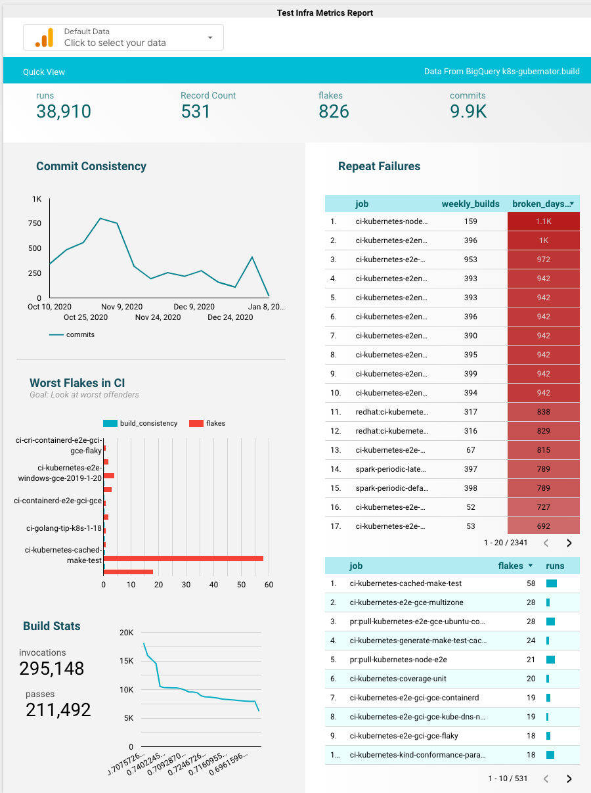

# Bigquery metrics

This `metrics-bigquery` job generates metrics that summarize data in our Bigquery
test result database. Each metric is defined with a config file that is consumed
by the `metrics-bigquery` periodic prow job.  Each metric config is a yaml file
like the following:

```yaml
# Metric name
metric: failures
# BigQuery query
query: |
  #standardSQL
  select /* find the most recent time each job passed (may not be this week) */
    job,
    max(started) latest_pass
  from `k8s-gubernator.build.all`
  where
    result = 'SUCCESS'
  group by job

# JQ filter to make daily results from raw query results
jqfilter: |
  [(.[] | select((.latest_pass|length) > 0)
  | {(.job): {
      latest_pass: (.latest_pass)
  }})] | add
```

## Visualizations and Charts
:warning: This is a work in progress, if you would like to contribute to the Graphs or Request a graph be added Etc, please create an issue with the `/area metrics` tag. See #20067 :warning:

[](https://storage.googleapis.com/k8s-metrics/k8s-metrics-report/metrics-report.html)


## Metrics

* build-stats - number of daily builds and pass rate
    - [Config](configs/build-stats.yaml)
    - [build-stats-latest.json](http://storage.googleapis.com/k8s-metrics/build-stats-latest.json)
* presubmit-health - presubmit failure rate and timing across PRs
    - [Config](configs/presubmit-health.yaml)
    - [presubmit-health-latest.json](http://storage.googleapis.com/k8s-metrics/presubmit-health-latest.json)
* failures - find jobs that have been failing the longest
    - [Config](configs/failures-config.yaml)
    - [failures-latest.json](http://storage.googleapis.com/k8s-metrics/failures-latest.json)
* flakes - find the flakiest jobs this week (and the flakiest tests in each job).
    - [Config](configs/flakes-config.yaml)
    - [flakes-latest.json](http://storage.googleapis.com/k8s-metrics/flakes-latest.json)
* flakes-daily - find flakes from the previous day. Similar to `flakes`, but creates more granular results.
    - [Config](configs/flakes-daily-config.yaml)
    - [flakes-daily-latest.json](http://storage.googleapis.com/k8s-metrics/flakes-daily-latest.json)
* flakes-experiment - Trial run of `flakes` using new repo field in BQ (#19209)
    - [Config](configs/flakes-experiment-config.yaml)
    - [flakes-experiment-latest.json](http://storage.googleapis.com/k8s-metrics/flakes-experiment-latest.json)
* job-health - compute daily health metrics for jobs (runs, tests, failure rate for each, duration percentiles)
    - [Config](configs/job-health.yaml)
    - [job-health-latest.json](http://storage.googleapis.com/k8s-metrics/job-health-latest.json)
* job-flakes - compute consistency of all jobs
    - [Config](configs/job-flakes-config.yaml)
    - [job-flakes-latest.json](http://storage.googleapis.com/k8s-metrics/job-flakes-latest.json)
* pr-consistency - calculate PR flakiness for the previous day.
    - [Config](configs/pr-consistency-config.yaml)
    - [pr-consistency-latest.json](http://storage.googleapis.com/k8s-metrics/pr-consistency-latest.json)
* weekly-consistency - compute overall weekly consistency for PRs
    - [Config](configs/weekly-consistency-config.yaml)
    - [weekly-consistency-latest.json](http://storage.googleapis.com/k8s-metrics/weekly-consistency-latest.json)
* istio-job-flakes - compute overall weekly consistency for postsubmits
    - [Config](configs/istio-flakes.yaml)
    - [istio-job-flakes-latest.json](http://storage.googleapis.com/k8s-metrics/istio-job-flakes-latest.json)

## Adding a new metric

To add a new metric, create a PR that adds a new yaml config file
specifying the metric name (`metric`), the bigquery query to execute (`query`), and a
jq filter to filter the data for the daily and latest files (`jqfilter`).

Run `./bigquery.py --config configs/my-new-config.yaml` and verify that the
output is what you expect.

Add the new metric to the list above.

After merging, find the new metric on GCS within 24 hours.

## Testing Metrics
The metrics executed in these queries are stored in [BigQuery](https://cloud.google.com/bigquery). The tables that hold k8s test data are populated by [Kettle](https://github.com/kubernetes/test-infra/blob/master/kettle/README.md) and live in the `k8s-gubernator` project of [Big Query Tables].

From these tables open `k8s-gubernator` -> `build` -> `<table you care about>`
- Click on `Query Table`
- Build or Copy Query into the editor
- Click `> Run`
- The results will be visible in a table at the bottom

You can see the last time a table was updated by selecting a table, and opening the `Details` tab. The `Last modified` field will show the last time this table was updated. If data is stale, please create an issue against `Kettle`.

## Details

Each query is run every 24 hours to produce a json
file containing the complete raw query results named with the format
`raw-yyyy-mm-dd.json`. The raw file is then filtered with the associated
jq filter and the results are stored in `daily-yyyy-mm-dd.json`.  These
files are stored in the k8s-metrics GCS bucket in a directory named with
the metric name and persist for a year after their creation. Additionally,
the latest filtered results for a metric are stored in the root of the
k8s-metrics bucket and named with the format `METRICNAME-latest.json`.

If a config specifies the optional jq filter used to create influxdb timeseries
data points, then the job will use the filter to generate timeseries points from
the raw query results.

At one point, these points were uploaded to a system called velodrome, which had an influxdb instance where they can be used to create graphs and tables, but velodrome is no longer in existence.  This may be revised in the future.

## Query structure

The `query` is written in `Standard SQL` which is really [BigQuery Standard SQL](https://cloud.google.com/bigquery/docs/reference/standard-sql/query-syntax) that allows for working with arrays/repeated fields. Each sub-query, from the most indented out, will build a subtable that the outer query runs against. Any one of the sub query blocks can be run independently from the BigQuery console or opionally added to a test query config and run via the same `bigquery.py` line above.

## Consistency

Consistency means the test, job, pr always produced the same answer. For
example suppose we run a build of a job 5 times at the same commit:
* 5 passing runs, 0 failing runs: consistent
* 0 passing runs, 5 failing runs: consistent
* 1-4 passing runs, 1-4 failing runs: inconsistent aka flaked

[Big Query Tables]: https://console.cloud.google.com/bigquery?utm_source=bqui&utm_medium=link&utm_campaign=classic&project=k8s-gubernator